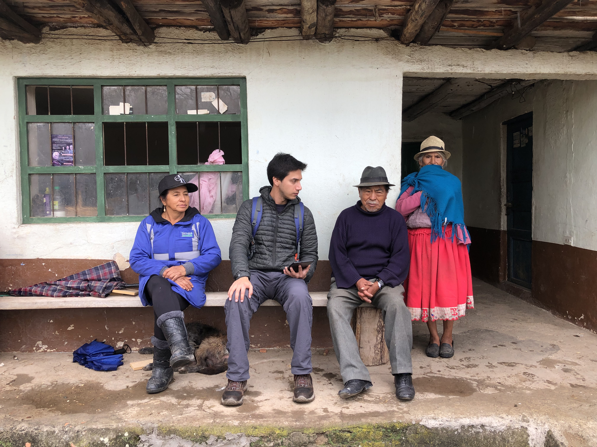
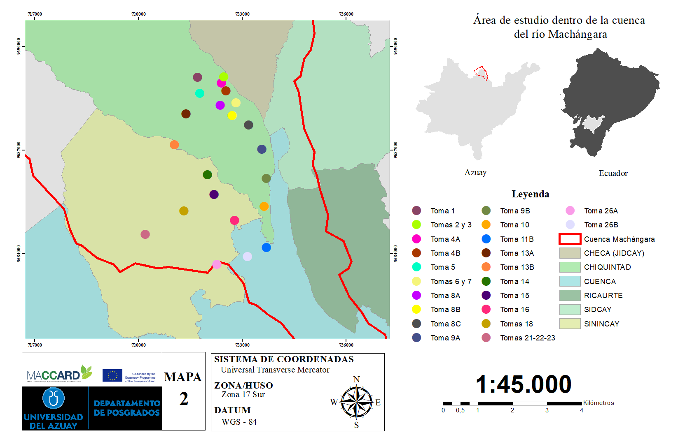
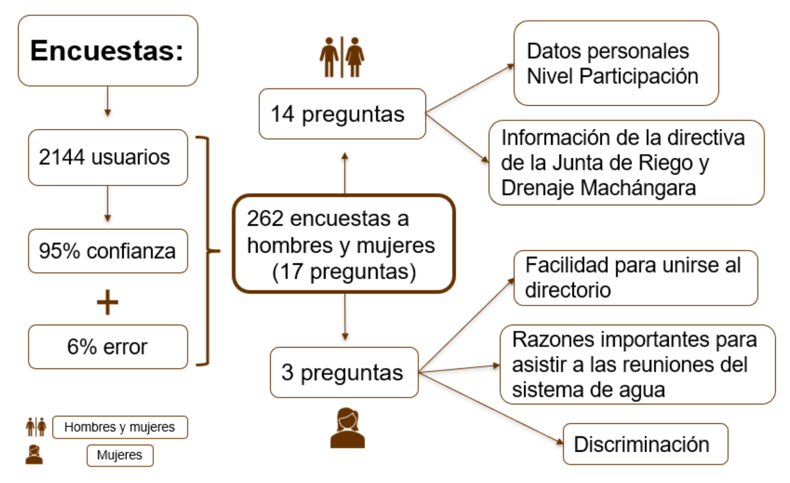

# Factores que inciden en la representatividad de las mujeres para la toma de decisiones en la gestión del recurso hídrico.
El presente estudio, es una análisis de los factores que inciden en la representatividad de las mujeres en la junta de agua,
caso de estudio de la Junta de Riego y Drenaje Machángara. Estos datos se obtuvieron a través de la aplicación de ***encuestas 
a 262 usuarios de diferentes tomas de agua***. Los **datos desglosados por sexo**, son datos que permiten *detectar brechas económicas, 
sociales o de salud entre ambos sexos* (como diferencias salariales o acceso a recursos). Para este caso se levanto información de hombres y mujeres 
de la junta de riego ya que el objetivo del estudio es conocer la disparidad de género en la gestión de los recursos hídricos.
Varios estudios mencionan qye la división de género impuesta por las normas laborales y sociales adjudica numerosas responsabilidades relacionadas con el agua a la mujer, mientras que otorgan la mayoría de los poderes y derechos sobre este recurso a los hombres (*Anderson, 2011; Naciones Unidas, 2012*). 

<figure>
  
  <figcaption><i>Usuarios de la Junta de Riego y Drenaje Machángara. Autor: Isabel Chumi.</i></figcaption>
</figure>

## Área de estudio
El presente estudio se realizó en la Junta de Riego y Drenaje Machángara, perteneciente a la cuenca del río Machángara, 
la cuenca está ubicada en dos provincias de la zona sur del Ecuador, el área de estudio estaba ubicada en la provincia del Azuay, 
esta cuenca es de gran importancia, cuenta con una superficie aproximada de 32.500 hectáreas, abastece cerca del 60% de agua potable a la ciudad de Cuenca,
también genera 39,5 MW de energía, 11 hidroeléctrica y proporciona agua de riego para 2.900 usuarios, cubriendo un total de 1.900 ha, 
dedicadas a la producción agropecuaria (*Argüello Ruiz, 2020*; *Ministerio de Ambiente, Agua y Transición Ecológica et al., 2022*).

<figure>
  
  <figcaption><i>Mapa del Área de estudio, Autor: Isabel Chumi.</i></figcaption>
</figure>

## Metodología
A continuación, se describe como fueron aplicadas cada una de las metodologías.
Encuesta: Se aplicaron a los usuarios y usuarias activas de la Junta de Riego y Drenaje Machángara, pertenecientes a las 26 tomas de agua. 
Se presentó un cuestionario de **17 preguntas cerradas modificadas a partir del Cuestionario para recopilar datos sobre el agua desglosados por sexo** 
(*Grupo de Trabajo del WWAP sobre Indicadores Desglosados por Sexo, 2015*).
Este cuestionario estaba dividido en tres secciones: Sección Uno: Datos personales, Sección Dos: Datos del entrevistado 
y Sección tres: Datos de la directiva de la Junta de Riego y Drenaje Machángara. 
De las 17 preguntas, 14 preguntas estaban dirigidas a hombres y mujeres encuestadas, por otro lado, existieron tres preguntas dirigidas solo a mujeres 
con el objetivo de conocer sus percepciones con relación a la gestión del recurso hídrico. 

<figure>
  
  <figcaption><i>Metodología de aplicación de encuestas, Autor: Isabel Chumi.</i></figcaption>
</figure>

## Problemas que desea resolver o preguntas que espera contestar con los datos.
1. Conocer cuáles son los factores que inciden para que las mujeres sean tomadoras de decisiones.
2. Conocer la distribución de las mujeres lideresas dentro de la Junta de Riego y Drenaje Machángara.
3. Conocer que toma de agua presenta mayores factores que impiden a las mujeres ser lideresas de su toma de agua.

